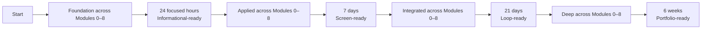
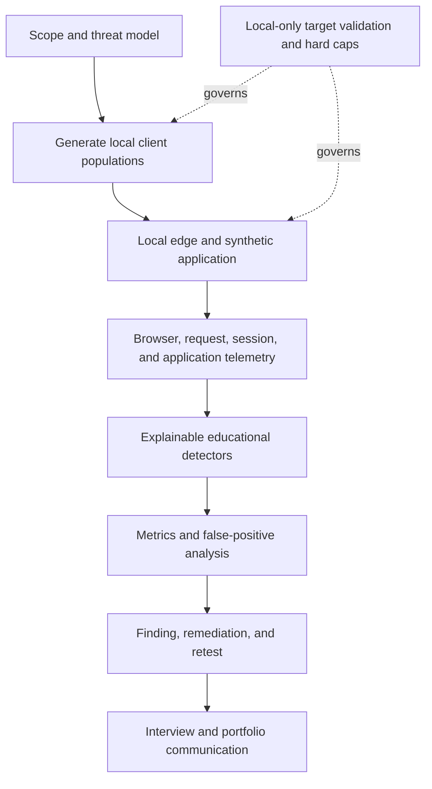

# Awesome Adversarial Traffic Engineering

> A practical field guide, interview curriculum, and safe local research lab for bots, scraping, automated abuse, browser intelligence, DDoS, WAFs, CDNs, and edge defense.

Awesome Adversarial Traffic Engineering is a practical learning and research repository for understanding how automated clients, browser agents, abusive workflows, and denial-of-service traffic interact with modern edge defenses. It combines a curated knowledge base, a structured interview curriculum, and a safe local lab.

> **Safety notice:** Run traffic only against the included local services. The lab rejects public addresses, arbitrary hostnames, and user-selected remote targets. Read [SAFETY.md](SAFETY.md) before running a client or load scenario.

This project is independently created, uses synthetic data, and is intended for authorized security education and defensive research. It is not affiliated with or endorsed by any employer and contains no employer-confidential information.

## Start here: one path, four exit ramps

**[Start the Path](curriculum/path.md)**

There are not four courses. Every learner follows the same nine modules and revisits them at greater depth. The time horizons are cumulative checkpoints where a learner may exit with a coherent set of demonstrated skills.



| Exit ramp | Complete | Demonstrated capability | Scope of claim |
|---|---|---|---|
| 24 cumulative focused hours | Foundation in Modules 0–8 | Understand, discuss, and perform one basic role demonstration | Informational-ready, not domain-expert |
| 7 calendar days | Applied in Modules 0–8 | Demonstrate every core skill independently | Screen-ready for an adjacent-background L5 candidate |
| 21 calendar days | Integrated in Modules 0–8 | Run and explain an end-to-end engagement | Loop-ready with a credible hands-on portfolio |
| 6 weeks | Deep in Modules 0–8 | Investigate independently and defend original work | Portfolio-ready and able to ramp independently |

Checkpoint pages are indexes into module sections, not lesson copies: [24 hours](curriculum/checkpoints/24-hours.md), [7 days](curriculum/checkpoints/7-days.md), [21 days](curriculum/checkpoints/21-days.md), and [6 weeks](curriculum/checkpoints/6-weeks.md).

## The nine modules

1. [Safety and red-team engagement discipline](curriculum/modules/00-safety-and-engagement.md)
2. [Web request path and network fundamentals](curriculum/modules/01-request-path-and-network.md)
3. [Automated abuse and threat modeling](curriculum/modules/02-automated-abuse.md)
4. [Browser automation](curriculum/modules/03-browser-automation.md)
5. [Browser signals and bot detection](curriculum/modules/04-browser-signals-and-detection.md)
6. [Edge controls and DDoS resilience](curriculum/modules/05-edge-and-ddos.md)
7. [Practical Python and secure code review](curriculum/modules/06-python-and-code-review.md)
8. [Experimental method, detection analysis, and reporting](curriculum/modules/07-experiment-analysis-reporting.md)
9. [Interview communication and role translation](curriculum/modules/08-interview-communication.md)

## Contents

- [Who this is for](#who-this-is-for)
- [Scope](#scope)
- [Target competency map](#target-competency-map)
- [Architecture](#architecture)
- [Quick start](#quick-start)
- [Repository map](#repository-map)
- [Resources and labs](#resources-and-labs)
- [Capstone deliverables](#capstone-deliverables)
- [Readiness](#readiness)
- [FAQ](#faq)

## Who this is for

The path is designed for security engineers moving from networking, detection engineering, incident response, threat hunting, application security, or adjacent specialties into adversarial traffic research. It assumes security judgment and rewards evidence-driven work; it does not assume prior browser-research expertise.

## Scope

In scope:

- Automated abuse and business-workflow threat modeling
- Browser automation, signals, and cross-layer consistency
- Detection measurement and false-positive analysis
- Edge controls and bounded application-layer resilience testing
- Practical Python, secure code review, experimental method, and reporting
- Interview communication grounded in produced artifacts

Out of scope:

- Testing third-party or production services
- Credential theft, leaked data, proxy rotation, CAPTCHA solving, malware, or stealth packages
- Raw packet floods, reflection, amplification, spoofing, or attack infrastructure
- Claims that a fingerprint proves identity or a toy detector is production-ready

## Target competency map

| Competency | Canonical module | Evidence |
|---|---|---|
| Engagement safety | Module 0 | Scope, caps, abort criteria, evidence plan, retest |
| Request and control path | Module 1 | Architecture diagram and telemetry/capacity explanation |
| Abuse reasoning | Module 2 | Goal-to-workflow threat map with false-positive risk |
| Representative browser client | Module 3 | Local Playwright workflow with request evidence |
| Layered detection | Module 4 | Signal matrix and per-population evaluation |
| Resilience | Module 5 | Bounded Layer 7 plan and measured local experiment |
| Security tooling | Module 6 | Tested log analyzer and secure review findings |
| Research and reporting | Module 7 | Reproducible experiment, finding, and retest |
| Role communication | Module 8 | Narrative, technical briefing, and mock-loop evidence |

## Architecture

The curriculum mirrors the work cycle and the lab produces evidence for that cycle.



## Quick start

Read the orientation and select only a stopping point—not a separate curriculum:

```text
1. Read SAFETY.md
2. Open curriculum/path.md
3. Complete Module 0 Foundation
4. Record progress in curriculum/progress.yaml
5. Run the progress report
```

When Python is available:

```bash
python scripts/progress.py
python scripts/validate_curriculum.py
python -m unittest discover -s tests -v
```

For the local vertical slice:

```bash
docker compose -f lab/docker-compose.yml up --build
curl http://localhost:8080/health
```

See [Getting started](docs/getting-started.md) and the [lab guide](lab/README.md) for expected output and cleanup.

## Repository map

| Area | Purpose |
|---|---|
| [`curriculum/`](curriculum/README.md) | Canonical path, module lessons, checkpoint views, gates, and tracking |
| [`awesome/`](awesome/README.md) | Annotated resources labeled by level and priority |
| [`docs/`](docs/index.md) | Orientation, concepts, navigation, and progress guidance |
| [`lab/`](lab/README.md) | Local-only synthetic app, clients, detector, fixtures, and analysis |
| [`interview/`](interview/README.md) | Role translation linked to module artifacts |
| [`templates/`](templates/README.md) | Engagement, experiment, finding, and retest artifacts |
| [`scripts/`](scripts/README.md) | Curriculum, link, safety, and progress checks |

## Resources and labs

Resources use two required labels: one of `[L1 Foundation]`, `[L2 Applied]`, `[L3 Integrated]`, or `[L4 Deep]`; and one of `[Required]`, `[Recommended]`, or `[Optional]`. Start with the small L1 required set and defer complete RFCs, Chromium source, agent frameworks, and advanced protocol internals.

- [Resource catalog](awesome/README.md)
- [Lab-to-module map](curriculum/lab-mapping.md)
- [Progress model](docs/progress-tracker.md)
- [Interview-to-module map](interview/README.md)

## Capstone deliverables

- Safe engagement plan
- Request-path and lab architecture diagram
- Threat map and client-population matrix
- Detection evaluation with per-population false-positive analysis
- Bounded resilience experiment
- Reproducible technical finding and retest
- Executive summary and five-minute briefing
- Mock-loop scorecard and first-90-day proposal

## Readiness

Each gate tests five outcomes: explain, build or run, measure, communicate, and operate safely. Elapsed time alone never passes a gate.

- [ ] I can explain the current level without hiding behind product names.
- [ ] I can run the required local task and show its artifact.
- [ ] I can interpret at least one quantitative result and its limitations.
- [ ] I can communicate a concise finding or answer.
- [ ] I can state authorization, scope, caps, abort criteria, and non-claims.

This is a learning assessment, not a hiring prediction. See the [four readiness gates](curriculum/gates/README.md).

## FAQ

### Is the 24-hour checkpoint a crash course due tomorrow?

No. It is approximately 24 cumulative focused study hours. It is intentionally the minimum complete pass through all nine modules.

### Do I start a new course after a checkpoint?

No. Continue to the next depth section of the same modules.

### Does the lab bypass commercial defenses?

No. It uses transparent educational rules, synthetic data, and local targets to teach measurement and tradeoffs.

### Are fingerprints identities?

No. They are fallible observations and pivots. Combine them with context, measure error, and protect legitimate populations.

### Can progress predict an interview result?

No. It reports completed evidence and missing gate conditions only.

## Contributing and license

Read [CONTRIBUTING.md](CONTRIBUTING.md), [CODE_OF_CONDUCT.md](CODE_OF_CONDUCT.md), and [SECURITY.md](SECURITY.md). Code and original documentation are available under the [MIT License](LICENSE); linked resources retain their own licenses.

